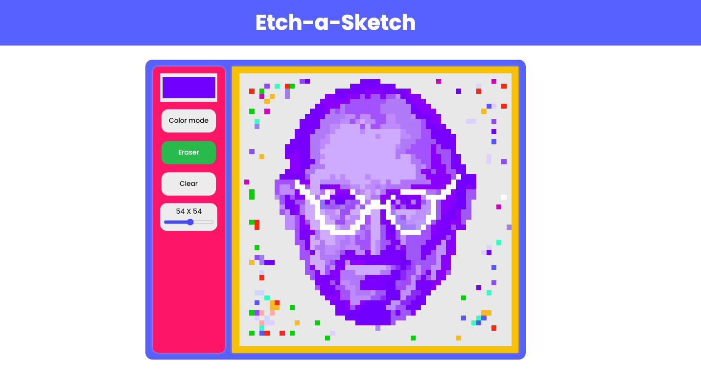

# etch-a-sketch

## [Live Demo](https://salvantjeff.github.io/etch-a-sketch/)

## Introduction 

A web etch-a-sketch application was created to hopefully bring back the nostalgic feeling of playing with an etch-a-sketch. The app was fun to make and play around with it. It was challenging but interesting to learn/figuring out what drawing means to a computer, for instance, dealing with the cursor, mouse clicks, mouse drag, and translating all of that to the stroke.

The project was built with HTML, CSS, and JS. It consists of a canvas for the user to draw anything they desire. Also, it has a controls tab to allow the user to customize their canvas' dimensions, and pen color, erase, and clear the canvas.
